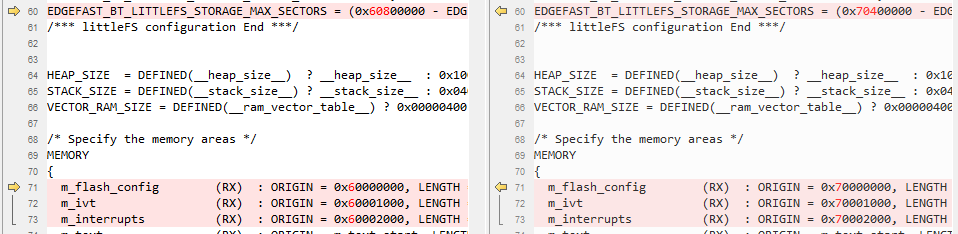

# Arm GCC

1.  Navigate to `<rt1064_install_dir>/boards/evkmimxrt1064/edgefast_bluetooth_examples/peripheral_ht/armgcc/`.
2.  Rename the following files.

    |Path|Previous name|**New name**|
    |----|-------------|------------|
    |`<rt1064_install_dir>/middleware/wireless/ethermind/`|`middleware_edgefast_bluetooth_k32w061_controller_MIMXRT1062.cmake`|`middleware_edgefast_bluetooth_k32w061_controller_MIMXRT1064.cmake`|

3.  Make following changes.

    |File name|**Previous item**|**New item**|
    |---------|-----------------|------------|
    |`config.cmake`|1060|1064|
    |1062|1064|
    |`flags.cmake`|1062|1064|
    |`CMakeLists.txt`|1060|1064|
    |1062|1064|

4.  *mflash* is used in RT1064 instead of flash\_adapter,therefore, comment `include(component_flexspi_nor_flash_adapter_rt1064_MIMXRT1064)` in *CMakeLists.txt*.
5.  Rename `MIMXRT1062xxxxx_flexspi_nor.ld` as `MIMXRT1064xxxxx_flexspi_nor.ld` and make the following changes.

     

**Parent topic:**[Migrate examples from RT1060EVK to RT1064](../topics/migrate_examples_from_rt1060evk_to_rt1064.md)

