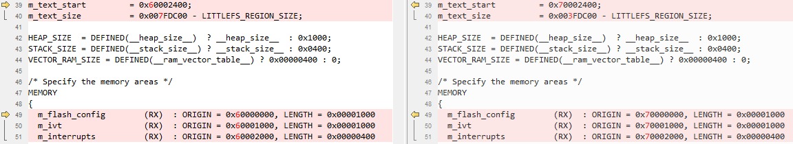

# Arm GCC

1.  Navigate to `<rt1064_install_dir>/boards/evkmimxrt1064/edgefast_bluetooth_examples/peripheral_ht/armgcc/`.
2.  Copy folder from `<rt1060evkc_install_dir>/boards/evkcmimxrt1060/edgefast_bluetooth_examples/template/` to `<rt1064_install_dir>/boards/evkmimxrt1064/edgefast_bluetooth_examples/` and rename the files.

    |**Path**|**Previous name**|**New name**|
    |`<rt1064_install_dir>/boards/evkmimxrt1064/edgefast_bluetooth_examples/`|`middleware_edgefast_bluetooth_mcux_linker_template_evkcmimxrt1060.cmake`|`middleware_edgefast_bluetooth_mcux_linker_template_evkmimxrt1064.cmake`|
    |`middleware_edgefast_bluetooth_sdio_template_evkcmimxrt1060.cmake`|`middleware_edgefast_bluetooth_sdio_template_evkmimxrt1064.cmake`|

3.  Add the following content to`<rt1064_install_dir>/devices/MIMXRT1064/all_lib_device.cmake` at appropriate location.

    ```
    …
      ${CMAKE_CURRENT_LIST_DIR}/../../boards
      ${CMAKE_CURRENT_LIST_DIR}/../../boards/evkmimxrt1064/edgefast_bluetooth_examples/template
      ${CMAKE_CURRENT_LIST_DIR}/../../middleware/edgefast_bluetooth
      ${CMAKE_CURRENT_LIST_DIR}/../../middleware/wireless/ethermind
    …
    include_if_use(middleware_edgefast_bluetooth_ble_ethermind_cm7f)
    include_if_use(middleware_edgefast_bluetooth_ble_ethermind_lib_cm7f)
    include_if_use(middleware_edgefast_bluetooth_br_ethermind_cm7f)
    include_if_use(middleware_edgefast_bluetooth_br_ethermind_lib_cm7f)
    include_if_use(middleware_edgefast_bluetooth_btble_ethermind_cm7f)
    include_if_use(middleware_edgefast_bluetooth_btble_ethermind_lib_cm7f)
    include_if_use(middleware_edgefast_bluetooth_common_ethermind)
    include_if_use(middleware_edgefast_bluetooth_common_ethermind_hci)
    include_if_use(middleware_edgefast_bluetooth_common_ethermind_hci_uart)
    include_if_use(middleware_edgefast_bluetooth_config_ethermind)
    include_if_use(middleware_edgefast_bluetooth_config_template)
    include_if_use(middleware_edgefast_bluetooth_extension_common_ethermind)
    include_if_use(middleware_edgefast_bluetooth_k32w061_controller)
    include_if_use(middleware_edgefast_bluetooth_mcux_linker_template_ evkmimxrt1064)
    include_if_use(middleware_edgefast_bluetooth_pal)
    include_if_use(middleware_edgefast_bluetooth_pal_db_gen_ethermind)
    include_if_use(middleware_edgefast_bluetooth_pal_host_msd_fatfs_ethermind)
    include_if_use(middleware_edgefast_bluetooth_pal_platform_ethermind)
    include_if_use(middleware_edgefast_bluetooth_porting)
    include_if_use(middleware_edgefast_bluetooth_porting_atomic)
    include_if_use(middleware_edgefast_bluetooth_porting_list)
    include_if_use(middleware_edgefast_bluetooth_porting_net)
    include_if_use(middleware_edgefast_bluetooth_porting_toolchain)
    include_if_use(middleware_edgefast_bluetooth_porting_work_queue)
    include_if_use(middleware_edgefast_bluetooth_profile_bas)
    include_if_use(middleware_edgefast_bluetooth_profile_dis)
    include_if_use(middleware_edgefast_bluetooth_profile_fmp)
    include_if_use(middleware_edgefast_bluetooth_profile_hps)
    include_if_use(middleware_edgefast_bluetooth_profile_hrs)
    include_if_use(middleware_edgefast_bluetooth_profile_hts)
    include_if_use(middleware_edgefast_bluetooth_profile_ipsp)
    include_if_use(middleware_edgefast_bluetooth_profile_pxr)
    include_if_use(middleware_edgefast_bluetooth_profile_tip)
    include_if_use(middleware_edgefast_bluetooth_profile_wu)
    include_if_use(middleware_edgefast_bluetooth_sdio_template_evkmimxrt1064)
    include_if_use(middleware_edgefast_bluetooth_shell)
    include_if_use(middleware_edgefast_bluetooth_shell_ble)
    include_if_use(middleware_edgefast_bluetooth_template)
    include_if_use(middleware_edgefast_bluetooth_wifi_nxp_controller_base)...  
    ```

4.  Make the following changes in the listed order.

    |File name|Previous item|New item|
    |---------|-------------|--------|
    |`config.cmake`|MIMXRT1062xxxxB|MIMXRT1064xxxxA|
    |mflash\_evkcmimxrt1060|mflash\_rt1064|
    |1062|1064|
    |evkcmimxrt1060|evkmimxrt1064|
    |`flags.cmake`|1062|1064|
    |6B|6A|
    |`CMakeLists.txt`|1062|1064|
    |`<rt1064_install_dir>/middleware/edgefast_bluetooth/middleware_edgefast_bluetooth_template.cmake`|evkcmimxrt1060|evkmimxrt1064|
    |`<rt1064_install_dir>/middleware/wireless/ethermind/middleware_edgefast_bluetooth_common_ethermind_hci_uart.cmake`|1062|1064|
    |`<rt1064_install_dir>/middleware/wireless/ethermind/ middleware_edgefast_bluetooth_k32w061_controller.cmake`|1062|1064|
    |`<rt1064_install_dir>/middleware/wireless/ethermind/middleware_edgefast_bluetooth_wifi_nxp_controller_base.cmake`|evkcmimxrt1060|evkmimxrt1064|
    |`<rt1064_install_dir>/boards/evkmimxrt1064/edgefast_bluetooth_examples/middleware_edgefast_bluetooth_mcux_linker_template_evkmimxrt1064.cmake`|1062|1064|
    |`<rt1064_install_dir>/boards/evkmimxrt1064/edgefast_bluetooth_examples/middleware_edgefast_bluetooth_sdio_template_evkmimxrt1064.cmake`|1062|1064|

5.  Rename `MIMXRT1062xxxxx_flexspi_nor.ld` as `MIMXRT1064xxxxx_flexspi_nor.ld` and make the following changes.

    


**Parent topic:**[Migrate examples from RT1060EVKC to RT1064](../topics/migrate_examples_from_rt1060evkc_to_rt1064.md)

