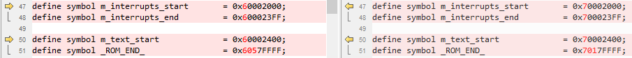
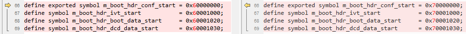
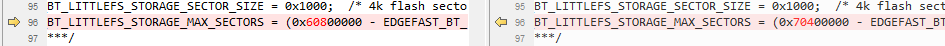

# IAR

1.  Navigate to `<rt1064_install_dir>/boards/evkmimxrt1064/edgefast_bluetooth_examples/peripheral_ht/iar/`.

2.  Make the following changes.

    |**File name**

|**Previous item**

|**New item**

|
    |---------------|-------------------|--------------|
    |`peripheral_ht.ewp`

|1060

|1064

|
    |1062

|1064

|

3.  Rename `MIMXRT1062xxxxx_flexspi_nor.icf` as `MIMXRT1064xxxxx_flexspi_nor.icf` and make the following changes.

      

**Parent topic:**[Migrate examples from RT1060EVK to RT1064](../topics/migrate_examples_from_rt1060evk_to_rt1064.md)

