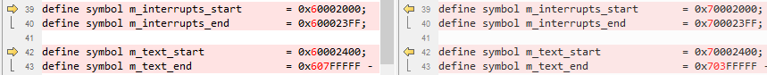
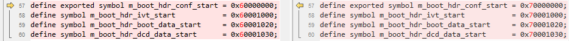

# IAR

1.  Navigate to `<rt1064_install_dir>/boards/evkmimxrt1064/edgefast_bluetooth_examples/peripheral_ht/iar/`.
2.  Make the following changes in the listed order.

    |File name|Previous item|New item|
    |---------|-------------|--------|
    |`peripheral_ht.ewp`|1062|1064|
    |mflash/evkcmimxrt1060|mflash/mimxrt1064|
    |evkcmimxrt1060|evkmimxrt1064|
    |6B|6A|

3.  Rename `MIMXRT1062xxxxx_flexspi_nor.icf` as `MIMXRT1064xxxxx_flexspi_nor.icf` and make the following changes.

     

**Parent topic:**[Migrate examples from RT1060EVKC to RT1064](../topics/migrate_examples_from_rt1060evkc_to_rt1064.md)

