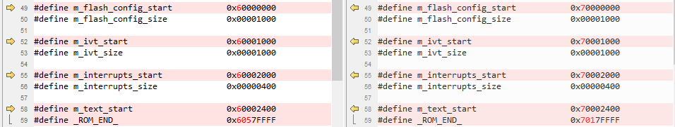
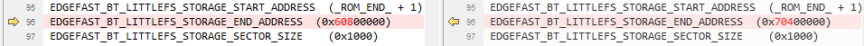

# MDK

1.  Navigate to `<rt1064_install_dir>/boards/evkmimxrt1064/edgefast_bluetooth_examples/peripheral_ht/mdk/`.
2.  Make following changes.

    |File name

|Previous item

|New item

|
    |-----------|---------------|----------|
    |`peripheral_ht.uvprojx`|1060

|1064

|
    |1062

|1064

|

3.  Copy `evkmimxrt1064_flexspi_nor.ini` from `<rt1064_install_dir>/boards/evkmimxrt1064/demo_apps/hello_world/mdk/` to `<rt1064_install_dir>/boards/evkmimxrt1064/edgefast_bluetooth_examples/peripheral_ht/mdk/`.
4.  Rename `MIMXRT1062xxxxx_flexspi_nor` as `MIMXRT1064xxxxx_flexspi_nor` and make the following changes.

     

**Parent topic:**[Migrate examples from RT1060EVK to RT1064](../topics/migrate_examples_from_rt1060evk_to_rt1064.md)

