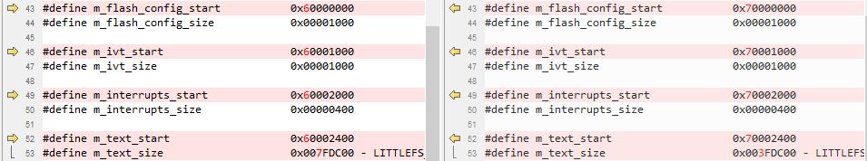

# MDK

1.  Navigate to `<rt1064_install_dir>/boards/evkmimxrt1064/edgefast_bluetooth_examples/peripheral_ht/mdk/`.
2.  Make the following changes in the listed order.

    | File name             | Previous item     | New item |
	| --------------------- | ----------------- | -------- |
	| peripheral_ht.uvprojx | 1062              | 1064     |
	|                       | mflash/evkcmimxrt1060 | mflash/mimxrt1064 |
	|                       | evkcmimxrt1060        | evkcmimxrt1064    |
	|                       | 6B                    | 6A                |

3.  Copy `evkmimxrt1064_flexspi_nor.ini` from `<rt1064_install_dir>/boards/evkmimxrt1064/demo_apps/hello_world/mdk/` to `<rt1064_install_dir>/boards/evkmimxrt1064/edgefast_bluetooth_examples/peripheral_ht/mdk/`.
4.  Rename `MIMXRT1062xxxxx_flexspi_nor` as `MIMXRT1064xxxxx_flexspi_nor` and make the following changes.

    

**Parent topic:**[Migrate examples from RT1060EVKC to RT1064](../topics/migrate_examples_from_rt1060evkc_to_rt1064.md)

