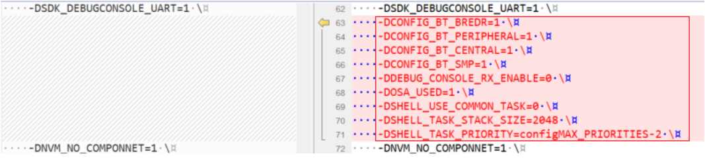

# Adjust project setting

To adjust the project settings, perform the following steps:

1.  Open the *flags.cmake* of the two examples respectively. The two files are in the *<install\_dir\>boards\\evkmimxrt1170\\edgefast\_bluetooth\_examples\\peripheral\_ht\\cm7\\armgcc* and *<install\_dir\>boards\\evkmimxrt1170\\edgefast\_bluetooth\_examples\\peripheral\_ht\\cm4\\armgcc* folders respectively.
2.  Search the ***CMAKE\_C\_FLAGS\_DEBUG*** section.
    1.  Compare the macro between the two sections.
    2.  Add the macros that do not exist in the **cm4** project but are available in the **cm7** project into the cm4 project. The rule is that macro setting should be same.
    3.  Delete the macros highlighted in the red rectangle.

        |

|

**Parent topic:**[Arm GCC](../topics/arm_gcc.md)

