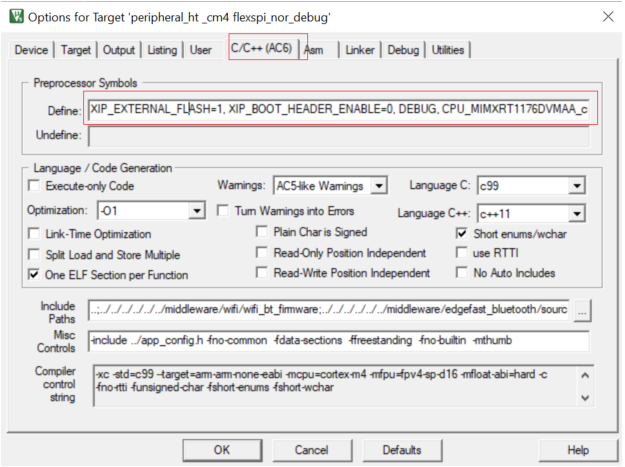
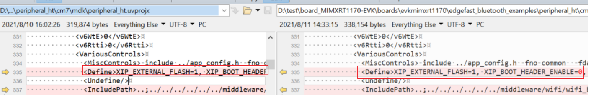

# Adjust project settings

1.  Compare the macro in the project settings: *preprocessor symbols*.
2.  Compare the macro that does exist in the cm4 project but exists in the cm7 project.
3.  Delete the following macro. The rule is that m7 macro setting should be same as m4 .

    The macro could also be found in be eripheral\_ht\_cm4.uvprojx.

    |

|

    |

|

**Parent topic:**[MDK](../topics/mdk.md)

