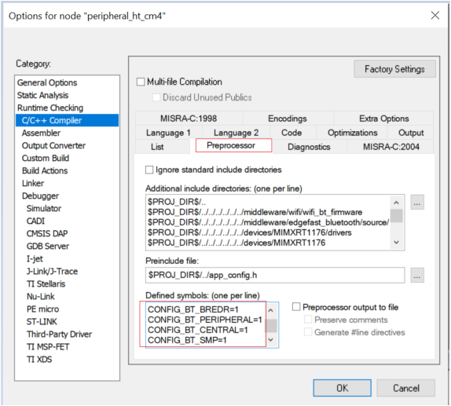
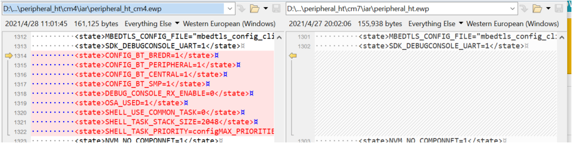

# Adjust project settings

To adjust the project settings, perform the following steps:

1.  Compare the macro in the project settings: **Option \> C/C++ compiler \> Preprocessor**.
2.  Find the macros that do not exist in the **cm4** project but are available in the **cm7** project. Delete these macro. The rule is that **m7** macro setting should be same with **m4**.

    |

|

    The macros are in the**peripheral\_ht\_cm4.ewp** file.

    |

|

**Parent topic:**[IAR](../topics/iar.md)

