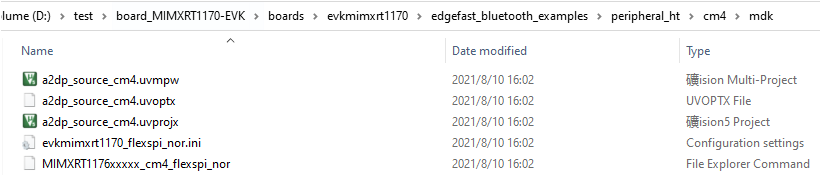

# Create an M4 project

1.  Copy folder *cm4* from *<install\_dir\>boards\\evkmimxrt1170\\edgefast\_bluetooth\_examples\\a2dp\_source\\cm4* into the folder in where the example must be enabled. In this case, copy folder *cm4* into directory *<install\_dir\>\\boards\\evkmimxrt1170\\edgefast\_bluetooth\_examples\\peripheral\_ht*.
2.  Open folder mdk from *<install\_dir\>boards\\evkmimxrt1170\\edgefast\_bluetooth\_examples\\peripheral\_ht\\cm4\\mdk*.

    |

|

3.  Change the filename *a2dp\_source\_cm4* to *peripheral\_ht\_cm4* respectively.
4.  Open the files *peripheral\_ht\_cm4.**uvmpw* and *peripheral\_ht\_cm4*. *uvoptx, peripheral\_ht\_cm4.uvprojx*with a text editor, such as Notepad, Notepad++, Sublime, or Visual Studio code.
5.  Search and replace *a2dp\_source\_cm4* with *peripheral\_ht \_cm4*, and then save the files.

    |

|

**Parent topic:**[MDK](../topics/mdk.md)

