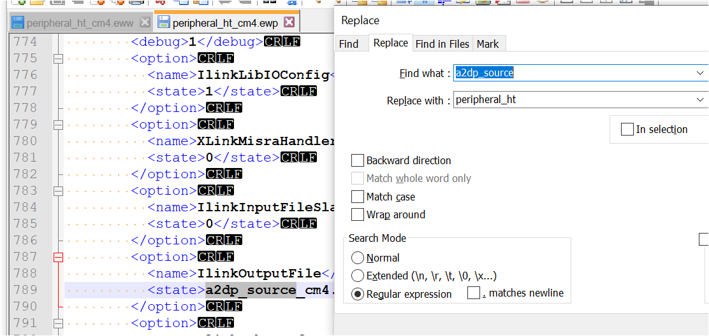

# Create an M4 project

To create an M4 project, perform the following steps:

1.  Copy the folder *cm4* in the directory *<install\_dir\>boards\\evkmimxrt1170\\edgefast\_bluetooth\_examples\\a2dp\_source\\cm4* into the folder in which the example should be enabled. In this case, copy the folder *cm4* into the directory *<install\_dir\>\\boards\\evkmimxrt1170\\edgefast\_bluetooth\_examples\\peripheral\_ht*.
2.  Open the folder *iar* in the directory *<install\_dir\>boards\\evkmimxrt1170\\edgefast\_bluetooth\_examples\\peripheral\_ht\\cm4\\iar*.
3.  Rename the files. Change the file name name *a2dp\_source\_cm4* to *peripheral\_ht\_cm4* in all the respective files.

    |

|

4.  Open the files *peripheral\_ht\_cm4.eww* and *peripheral\_ht\_cm4.ewp* with a text editor, such as Notepad, Notepad++, Sublime, or Visual Studio Code.
5.  Search and replace all *a2dp\_source\_cm4* with *peripheral\_ht \_cm4*, and then save the files.

    |

|

**Parent topic:**[IAR](../topics/iar.md)

