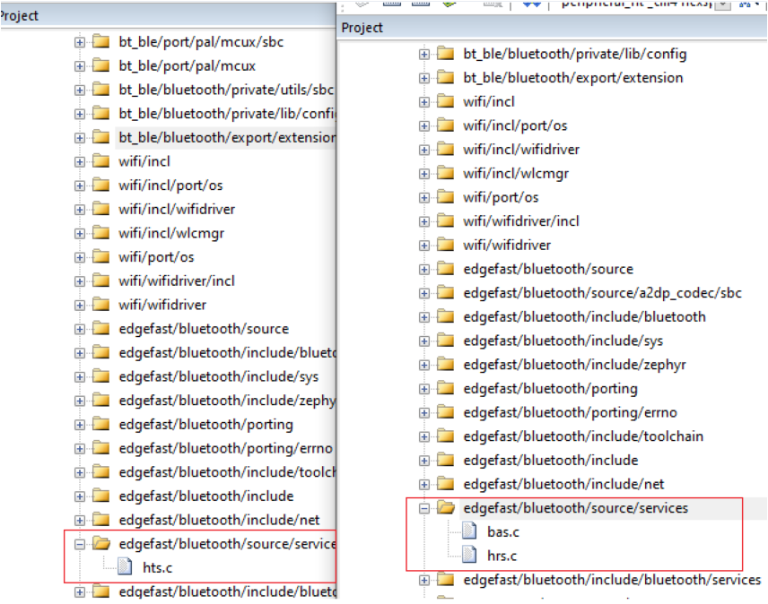

# Rearrange project files

1.  Open the *peripheral\_ht \_cm7* and *peripheral\_ht \_cm4* IAR projects. The two workspaces are located in *<install\_dir\>**boards\\evkmimxrt1170\\edgefast\_bluetooth\_examples\\peripheral\_ht \\cm7\\mdk* and *<install\_dir\>**boards\\evkmimxrt1170\\edgefast\_bluetooth\_examples\\peripheral\_ht \\cm4\\mdk* respectively.
    -   Compare the whole project directory, find file groups that the cm7 project has but the cm4 project not and then add these groups into the cm4 project.
    -   Compare the difference between the two groups with the same name, remove files that do not exist in the cm7 project but exist in the cm4 project; find files that the cm7 project has but the cm4 project not and then add these files into the cm4 project.
2.  For the *source* group, in this case, the files in the source group in the cm4 project must be removed, and the files in the path *<install\_dir\>\\boards\\evkmimxrt1170\\* *boards\\evkmimxrt1170\\edgefast\_bluetooth\_examples\\peripheral\_ht\\cm4* with the same name as the files in the cm7 project must be added into the *source* group.

    

3.  Compare the **service: group**.

    Peripheral hts profile is located in “**service**” folder. Add the hts.c file to the services group of the cm4 folder.

    

    .

**Parent topic:**[MDK](../topics/mdk.md)

