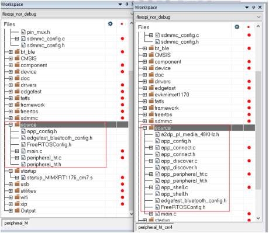
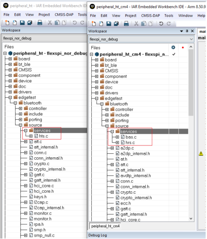

# Rearrange project files

To rearrange project files, perform the following steps:

1.  Open the *peripheral\_ht \_cm7*and *peripheral\_ht \_cm4* IAR projects in the directories *<install\_dir\> boards\\evkmimxrt1170\\edgefast\_bluetooth\_examples\\peripheral\_ht \\cm7\\iar* and *<install\_dir\> boards\\evkmimxrt1170\\edgefast\_bluetooth\_examples\\peripheral\_ht \\cm4\\iar*.
    1.  Compare the whole project directory, find file groups that the cm7 project has but are missing in the cm4 project. Add the missing file groups from the cm7 project into the cm4 project.
    2.  Compare the difference between the two groups with the same name. Remove files that do not exist in the cm7 project but exist in the cm4 project. Find files that are available in the cm7 project but are missing in the cm4 project. Add the missing files from the cm7 project into the cm4 project.
2.  For example, in the following figure, the files in the source group in the cm4 project must be removed, and the files in the path: *<install\_dir\>\\boards\\evkmimxrt1170\\edgefast\_bluetooth\_examples\\peripheral\_ht* with the same name as the files in the cm7 project must be added into the *source* group.

    

3.  Compare the *services* group.

    The peripheral hts profile is in the *services* folder. Add the hts.c file to the *services* group of the *cm4* folder.

    

**Parent topic:**[IAR](../topics/iar.md)

