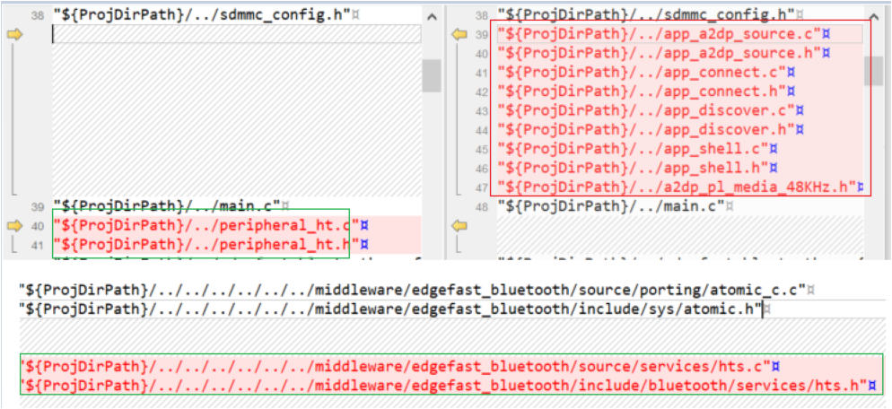

# Rearrange project files

To rearrange project files, perform the following steps:

1.  Open the *CMakeLists.txt* of the two examples respectively. The two files are in the *<install\_dir\>boards\\evkmimxrt1170\\edgefast\_bluetooth\_examples\\peripheral\_ht\\cm7\\armgcc* and *<install\_dir\>boards\\evkmimxrt1170\\edgefast\_bluetooth\_examples\\peripheral\_ht\\cm4\\armgcc* folders respectively.
2.  Search the section *add\_executable*. Compare the difference between the two sections. Remove files that do not exist in the *cm7* project but are available in the *cm4* project. Add the files that exist in the *cm7* project but are not available in the *cm4* project into the *cm4* project. For example, in the following figure, the files in the red box should be removed and the files in the green box must be added into the *cm4* project.

    

**Parent topic:**[Arm GCC](../topics/arm_gcc.md)

