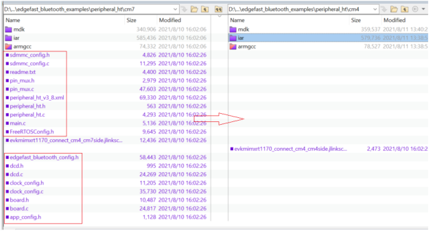

# Rearrange source files

1.  Open folder *cm4* in *<install\_dir\>**boards\\evkmimxrt1170\\edgefast\_bluetooth\_examples\\peripheral\_ht\\cm4*, and delete all files with the .c and .h file name extension.
2.  Copy files with the .c and .h filename extension in folder *cm7* with directory *<install\_dir\>* *boards\\evkmimxrt1170\\edgefast\_bluetooth\_examples\\peripheral\_ht\\cm7*to folder *cm4* with directory *<install\_dir\>* *boards\\evkmimxrt1170\\edgefast\_bluetooth\_examples\\peripheral\_ht\\cm4*.

    |

|

    .

**Parent topic:**[MDK](../topics/mdk.md)

