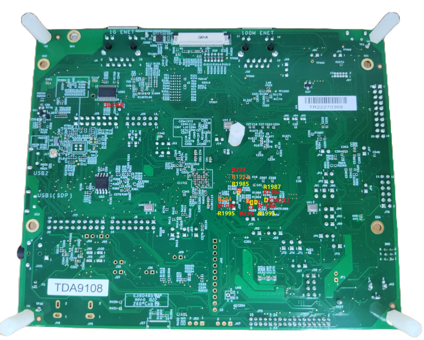

# Hardware rework 

-   **HCI UART rework**
    1.  Remove resistors R183 and R1816.
    2.  Solder 0 ohm resistor to R404, R1901, and R1902.

        

        

-   **PCM interface rework**
    1.  Disconnect header J79 and J80.
    2.  Connect header J81 and J82.
    3.  Remove resistors R1985, R1986, R1987, R1988, R1992, R1993, R1994, and R1995.
    4.  Solder 0 ohm resistor to R228, R229, R232, R234, and R1903.

        

        

-   LE Audio Synchronization interface rework \(only used on sink side\)
    1.  Connect J25-15 with J97.
    2.  Connect J25-13 with 2EL's GPIO\_27

        

         M.2 module's GPIO_27 (Sync_Signal) pad")

**Parent topic:**[Hardware Rework Guide for MIMXRT1170-EVKB and Murata 2EL M.2 Adapter](../topics/MIMXRT1170-EVKB_Murata_2EL.md)

