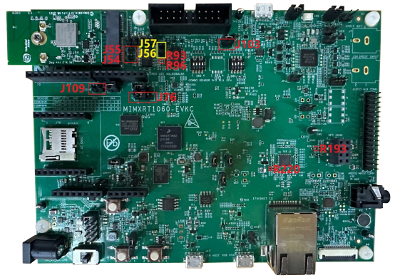

# Hardware rework 

-   HCI UART rework

1.  Mount R93, R96.
2.  Remove R193.
3.  Connect J109, connect J76 2-3.

-   PCM interface rework
    1.  Remove J54 and J55, connect J56, and J57.
    2.  Remove R220.
    3.  Connect J103.

        **Note:** When J103 is connected, flash cannot be downloaded. So, remove the connection when downloading flash and reconnect it after downloading.

        

-   LE Audio Synchronization interface rework \(only used on sink side\)

    1.  Remove J110 jumper cap.
    2.  Remove R196, R201, R213, and R211.
    3.  Connect J110-1 \(GPT2\_CLK\) to R2140 \(SAI\_MCLK\).
    4.  Connect ENET\_MDIO \(GPT2\_CAP1\) with J97 \(SAI\_SW\).
    5.  Connect ENET\_MDC \(GPT2\_CAP2\) with 2EL's GPIO\_27 \(Sync Signal\).

        

        

         M.2 module's GPIO_27
        									(Sync_Signal) pad")

**Parent topic:**[Hardware Rework Guide for MIMXRT1060-EVKC and Murata 2EL M.2 Adapter](../topics/MIMXRT1060EVKC_Murata2EL.md)

