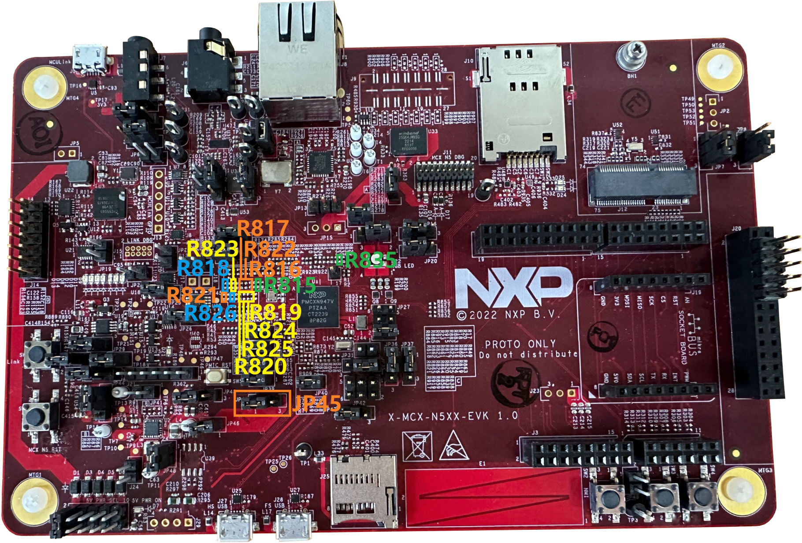

# Hardware Rework Guide for MCXN547-EVK and Murata M.2 Module 

This section is a brief hardware rework guidance of the EdgeFast Bluetooth PAL on the NXP MCXN547-EVK board and the Murata 1XK or 1ZM solution - direct M.2 connection to Embedded Artists’ EAR00385 \(1XK\) or EAR00364 \(1ZM\) M.2 modules. The hardware rework consists of two parts:

-   M.2 UART interface
-   M.2 SDIO interface

## Hardware rework {#MCXN548EVKrework .section}

-   M.2 UART interface rework
    -   Mount R835
    -   Connect JP45 2-3 to supply 1.8V for GPIO4
-   M.2 SDIO interface rework

    -   Remove R818, connect R823
    -   Remove R819, connect R824
    -   Remove R817, connect R822
    -   Remove R815, connect R816
    -   Remove R820, connect R825
    -   Remove R821, connect R826
    

