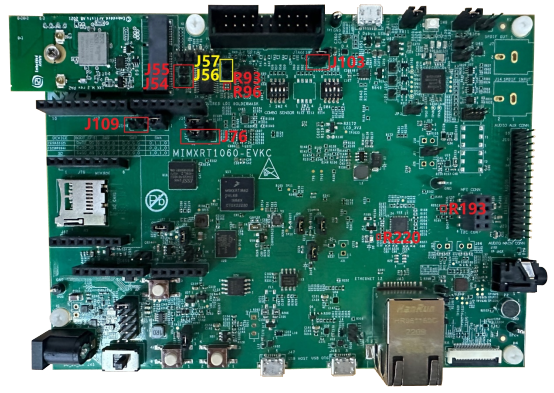

# Hardware rework 

-   **HCI UART rework**

1.  Mount R93, R96.
2.  Remove R193.
3.  Connect J109, connect J76 2-3.

-   **PCM interface rework**

1.  Remove J54 and J55, connect J56 and J57.
2.  Remove R220.
3.  Connect J103.

**Note:** When J103 is connected, flash cannot be downloaded. So, remove the connection when downloading flash and reconnect it after downloading.

**Parent topic:**[Hardware Rework Guide for MIMXRT1060-EVKC and Murata 1XK M.2 Adapter](../topics/RT1060EVKC_Murata_1XKM2.md)

