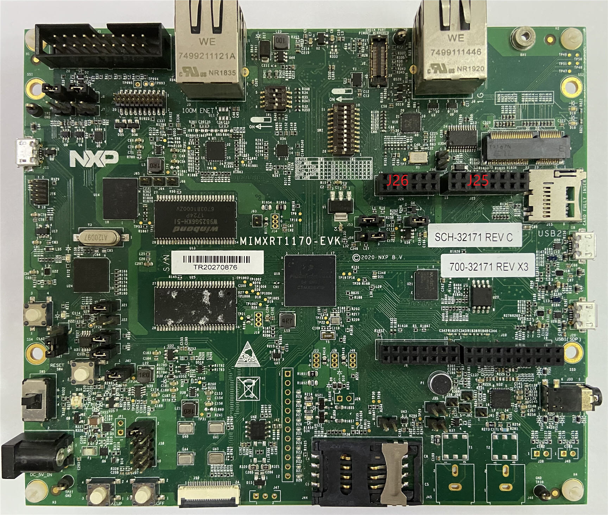
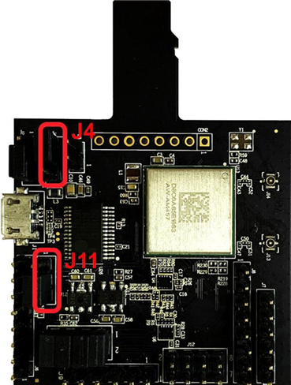

# Hardware rework

1.  HCI UART rework

    Connect the pins of two boards as the following table.

    |Pin Name|AW-AM457-uSD|i.MXRT1170|PIN NAME|GPIONAME of RT1170|
    |--------|------------|----------|--------|------------------|
    |**UART\_TXD**|J10 \(pin 4\)|J25 \(pin 13\)|LPUART7\_RXD|GPIO\_AD\_01|
    |**UART\_RXD**|J10 \(pin 2\)|J25 \(pin 15\)|LPUART7\_TXD|GPIO\_AD\_00|
    |**UART\_CTS**|J10 \(pin 8\)|J25 \(pin 9\)|LPUART7\_RTS|GPIO\_AD\_03|
    |**UART\_RTS**|J10 \(pin 6\)|J25 \(pin 11\)|LPUART7\_CTS|GPIO\_AD\_02|
    |**GND**|J6 \(pin 7\)|J26 \(pin 1\)|GND|GND|

    

    

    **Jumper Setting**:

    -   Connect J4\[2-3\] for VIO 3.3 V supply
    -   Connect J11\[2-3\] for VIO\_SD 3.3 V supply

**Parent topic:**[Hardware Rework Guide for MIMXRT1170-EVK and AW-AM457-uSD](../topics/hardware_rework_guide_for_mimxrt1170-evk_and_aw-am.md)

