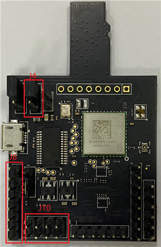
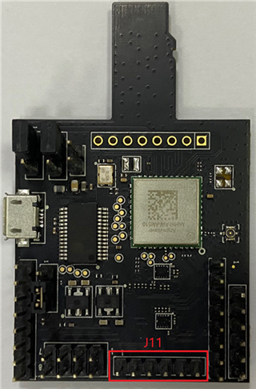

# Hardware rework

-   **HCI UART rework**

    Connect the pins of two boards as the following table.

    |Pin Name|AW-​AM510-​uSD|i.​MXRT685|PIN NAME|GPIO NAME of RT685|
    |--------|--------------|----------|--------|------------------|
    |**UART\_​TXD**|J10 \(pin 4\)|J27 \(pin 1\)|USART4\_RXD|FC4\_RXD\_SDA\_MOSI\_DATA|
    |**UART\_​RXD**|J10 \(pin 2\)|J27 \(pin 2\)|USART4\_TXD|FC4\_TXD\_SCL\_MISO\_WS|
    |**UART\_​RTS**|J10 \(pin 6\)|J47 \(pin 9\)|USART4\_CTS|FC4\_CTS\_SDA\_SSEL0|
    |**UART\_​CTS**|J10 \(pin 8\)|J27 \(pin 5\)|USART4\_RTS|FC4\_RTS\_SCL\_SSEL1|
    |**GND**|J6 \(pin 7\)|J29 \(pin 6\)|GND|GND|

    

    **Jumper Setting:**

    -   Connect J4\[2-3\] for VIO 3.3 V supply
-   **PCM interface rework**

    Connect the pins of two boards as the following table.

    |PIN NAME|AW-​AM510-​USD|i.MX RT685|PIN NAME of RT685|GPIONAME of RT685|
    |--------|--------------|----------|-----------------|-----------------|
    |**PCM\_​IN**|J11 \(pin 1\)|J47 \(pin 7\)|I2S2\_TXD|FC2\_RXD\_SDA\_MOSI\_DATA|
    |**PCM\_​OUT**|J11 \(pin 2\)|J28 \(pin 4\)|I2S5\_RXD|FC5\_RXD\_SDA\_MOSI\_DATA|
    |**PCM\_​SYNC**|J11 \(pin 3\)|J28 \(pin 5\)|I2S5\_WS|FC5\_TXD\_SCL\_MISO\_WS|
    |**PCM\_​CLK**|J11 \(pin 4\)|J28 \(pin 6\)|I2S5\_SCK|FC5\_SCK|
    |**GND**|J11 \(pin 6\)|J29 \(pin 7\)|GND|GND|

    

**Parent topic:**[Hardware Rework Guide for MIMXRT685-EVK and AW-AM510-uSD](../topics/hardware_rework_guide_for_mimxrt685-evk_and_aw-am5.md)

