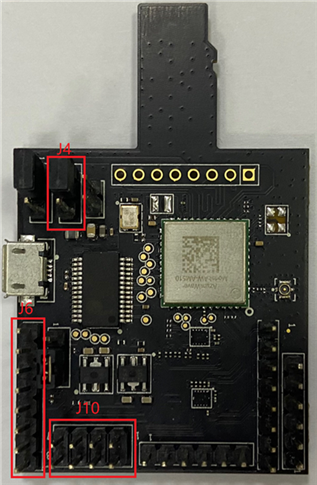
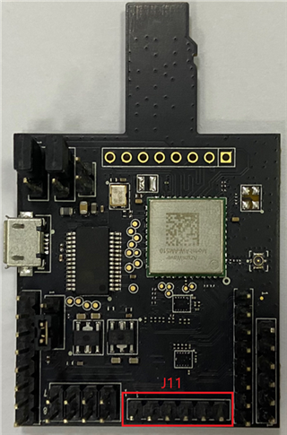

# Hardware rework

-   **HCI UART rework**

    Connect the pins of two boards as the following table.

    |**Pin Name**|**AW-​AM510-​uSD**|**i.​MXRT1060**|**PIN NAME**|**GPIO NAME of RT1060**|
    |------------|------------------|---------------|------------|-----------------------|
    |**UART\_​TXD**|J10 \(pin 4\)|J22 \(pin 1\)|LPUART3\_RXD|GPIO\_AD\_B1\_07|
    |**UART\_​RXD**|J10 \(pin 2\)|J22 \(pin 2\)|LPUART3\_TXD|GPIO\_AD\_B1\_06|
    |**UART\_​RTS**|J10 \(pin 6\)|J23 \(pin 3\)|LPUART3\_CTS|GPIO\_AD\_B1\_04|
    |**UART\_​CTS**|J10 \(pin 8\)|J23 \(pin 4\)|LPUART3\_RTS|GPIO\_AD\_B1\_05|
    |**GND**|J6 \(pin 7\)|J25 \(pin 7\)|GND|GND|

    

    **Jumper Setting:**

    -   Connect J4\[2-3\] for VIO 3.3 V supply
-   **PCM interface rework**

    Connect the pins of two boards as the following table.

    |**PIN NAME**|**AW-​AM510-​USD**|**I.​MXRT1060**|**PIN NAME OF RT1060**|**GPIO NAME of RT1060**|
    |------------|------------------|---------------|----------------------|-----------------------|
    |**PCM\_​IN**|J11 \(pin 1\)|J22 \(pin 5\)

|SAI2\_TXD

|GPIO\_AD\_B0\_09

|
    |**PCM\_​OUT**|J11 \(pin 2\)|TP11|SAI2\_RXD

|GPIO\_AD\_B0\_08

|
    |**PCM\_​SYNC**|J11 \(pin 3\)|J21 \(pin 9\)

|SAI2\_RX\_SYNC|\>GPIO\_AD\_01\_07|
    |**PCM\_​CLK**|J11 \(pin 4\)|J21 \(pin 7\)

|SAI2\_RX\_BCLK|GPIO\_AD\_B0\_06

|
    |**GND**|J11 \(pin 6\)|J21 \(pin 20\)

|GND

|GND

|

    

**Parent topic:**[Hardware Rework Guide for MIMXRT1060-EVK and AW-AM510-uSD](../topics/hardware_rework_guide_for_mimxrt1060-evk_and_aw-am.md)

