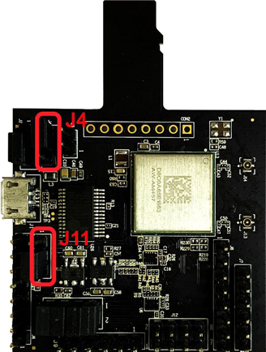

# Hardware rework

-   **HCI UART rework**

    Connect the pins of two boards as the following table.

    |**Pin Name**|**AW-AM457-uSD**|**i.MXRT1060**|**PIN NAME**|**GPIO NAME of RT1060**|
    |------------|----------------|--------------|------------|-----------------------|
    |**UART\_TXD**|J10 \(pin 4\)|J22 \(pin 1\)|LPUART3\_RXD|GPIO\_AD\_B1\_07|
    |**UART\_RXD**|J10 \(pin 2\)|J22 \(pin 2\)|LPUART3\_TXD|GPIO\_AD\_B1\_06|
    |**UART\_RTS**|J10 \(pin 6\)|J23 \(pin 3\)|LPUART3\_CTS|GPIO\_AD\_B1\_04|
    |**UART\_CTS**|J10 \(pin 8\)|J23 \(pin 4\)|LPUART3\_RTS|GPIO\_AD\_B1\_05|
    |**GND**|J6 \(pin 7\)|J25 \(pin 7\)|GND|GND|

    

    

    **Jumper Setting:**

    -   Connect J4\[2-3\] for VIO 3.3 V supply
    -   Connect J11\[2-3\] for VIO\_SD 3.3 V supply
-   **PCM interface rework**

    Connect the pins of two boards as the following table.

    |**PIN NAME**|**AW-AM457-USD**|**I.MXRT1060**|**PIN NAME**|**GPIO NAME of RT1060**|
    |------------|----------------|--------------|------------|-----------------------|
    |**PCM\_IN**|J9 \(pin 1\)|J22 \(pin 5\)|SAI2\_TXD|GPIO\_AD\_B0\_09|
    |**PCM\_OUT**|J9 \(pin 2\)|TP11|SAI2\_RXD|GPIO\_AD\_B0\_08|
    |**PCM\_SYNC**|J9 \(pin 3\)|J21 \(pin 9\)|SAI2\_RX\_SYNC|GPIO\_AD\_B0\_07|
    |**PCM\_CLK**|J9 \(pin 4\)|J21 \(pin 7\)|SAI2\_RX\_BCLK|GPIO\_AD\_B0\_06|
    |**GND**|J9 \(pin 6\)|J21 \(pin 20\)|GND|GND|

    

    **Note:**

    To support HFP feature, you must remove R316 and R323 on MIMXRT1060-EVK.

    To run HFP feature, you must remove J47 jumper.

    

**Parent topic:**[Hardware Rework Guide for MIMXRT1060-EVK and AW-AM457-uSD](../topics/hardware_rework_guide_for_mimxrt1060-evk_and_aw-am_001.md)

