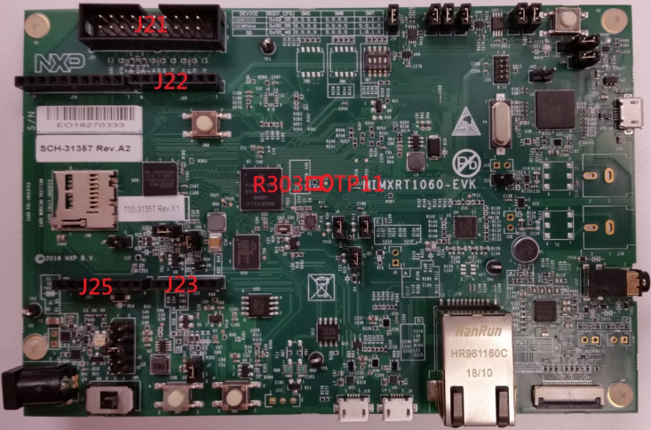
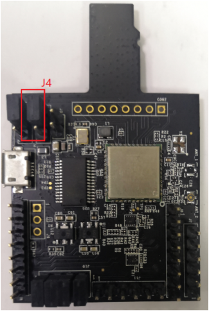
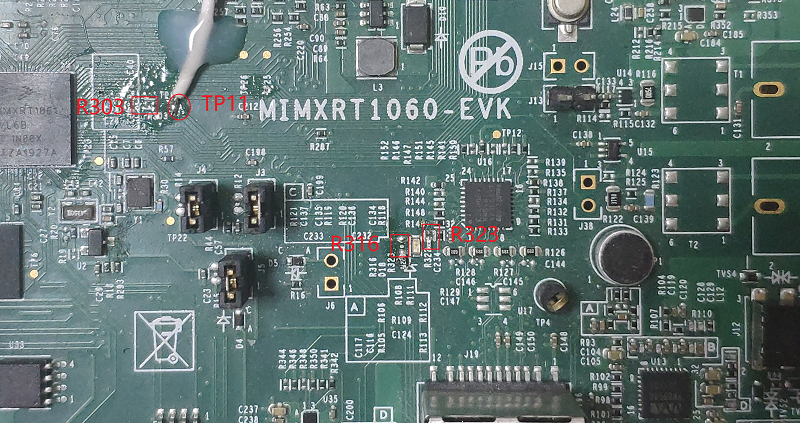
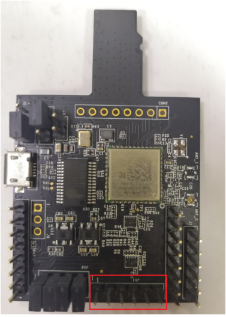

# Hardware rework

1.  **HCI UART rework**

    Connect the pins of two boards as the following table.

    |Pin Name|AW-CM358-USD|i.MXRT1060|PIN NAME|GPIO NAME of RT1060|
    |--------|------------|----------|--------|-------------------|
    |UART\_TXD|J10 \(pin 4\)

|J22 \(pin 1\)

|LPUART3\_RXD

|GPIO\_AD\_B1\_07

|
    |UART\_RXD|J10 \(pin 2\)

|J22 \(pin 2\)

|LPUART3\_TXD

|GPIO\_AD\_B1\_06

|
    |UART\_CTS|J10 \(pin 8\)

|J23 \(pin 4\)

|LPUART3\_RTS

|GPIO\_AD\_B1\_05

|
    |UART\_RTS|J10 \(pin 6\)

|J23 \(pin 3\)

|LPUART3\_CTS

|GPIO\_AD\_B1\_04

|
    |GND|J6 \(pin 7\)

|J25 \(pin 7\)

|GND

|GND

|

    

    

    Jumper Setting:

    Connect J4\[1-2\] for VIO 1.8 V supply.

2.  **PCM interface rework**

    Connect the pins of two boards as the following table.

    |PIN NAME|AW-CM358-USD|I.MXRT1060|PIN NAME|GPIO NAME of RT1060|
    |--------|------------|----------|--------|-------------------|
    |PCM\_IN|J11 \(pin 1\)

|J22 \(pin 5\)

|SAI2\_TXD

|GPIO\_AD\_B0\_09

|
    |PCM\_OUT|J11 \(pin 2\)

|TP11

|SAI2\_RXD

|GPIO\_AD\_B0\_08

|
    |PCM\_SYNC|J11 \(pin 3\)

|J21 \(pin 9\)

|SAI2\_RX\_SYNC

|GPIO\_AD\_B0\_07

|
    |PCM\_CLK|J11 \(pin 4\)

|J21 \(pin 7\)

|SAI2\_RX\_BCLK

|GPIO\_AD\_B0\_06

|
    |GND|J11 \(pin 6\)

|J21 \(pin 20\)

|GND

|GND

|

    

    **Note:**

    To support HFP feature, you must remove R316 and R323 on MIMXRT1060-EVK.

    To run HFP feature, you must remove J47 jumper.

    

**Parent topic:**[Hardware Rework Guide for MIMXRT1060-EVK and AW-CM358-uSD](../topics/hardware_rework_guide_for_mimxrt1060-evk_and_aw-cm.md)

