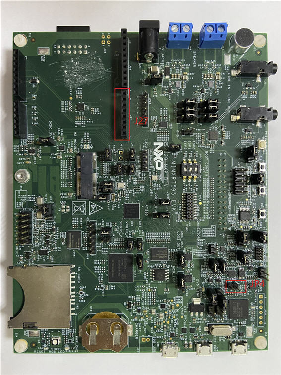

# Hardware rework

**Debug console serial rework:**

No special rework is required, except the following to enable the debug port.

-   Connect J39 with external power.
-   Connect JP4 1-2.
-   J27 1 — TX of USB to serial converter.

-   J27 2 — RX of USB to serial converter.

    

**Parent topic:**[Hardware Rework Guide for MIMXRT595-EVK and AW-AM510MA](../topics/hardware_rework_guide_for_mimxrt595-evk_and_aw-am5.md)

