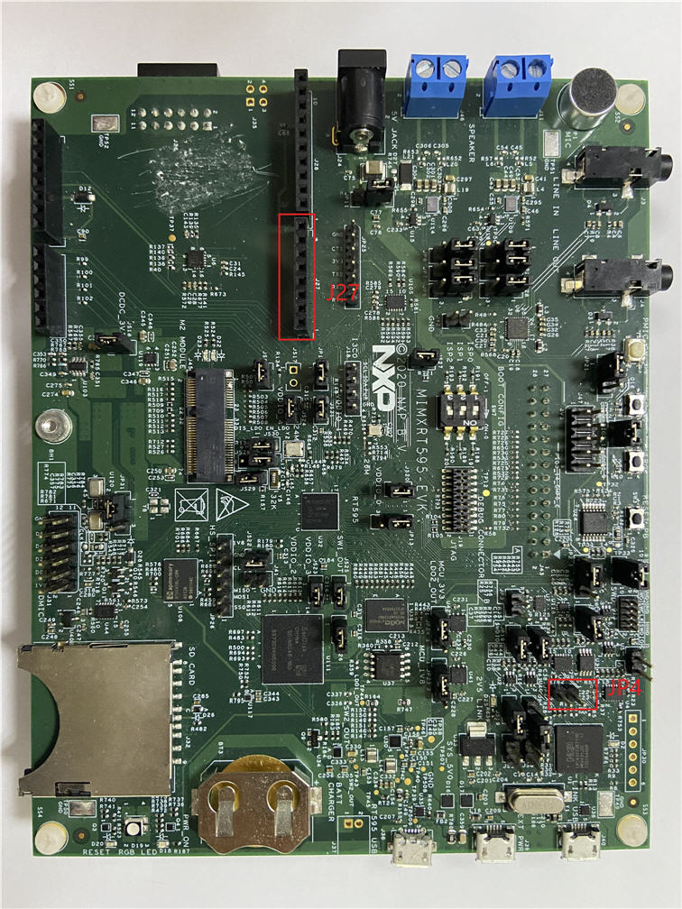

# Hardware rework

**Debug console serial rework:**

No special rework is required, except the following to enable the debug port.

-   JP4 1-2.
-   J27 1 - TX of USB to serial converter

-   J27 2 - RX of USB to serial converter

**Parent topic:**[Hardware Rework Guide for MIMXRT595-EVK and Murata M.2 Module](../topics/hardware_rework_guide_for_mimxrt595-evk_with_direc.md)

