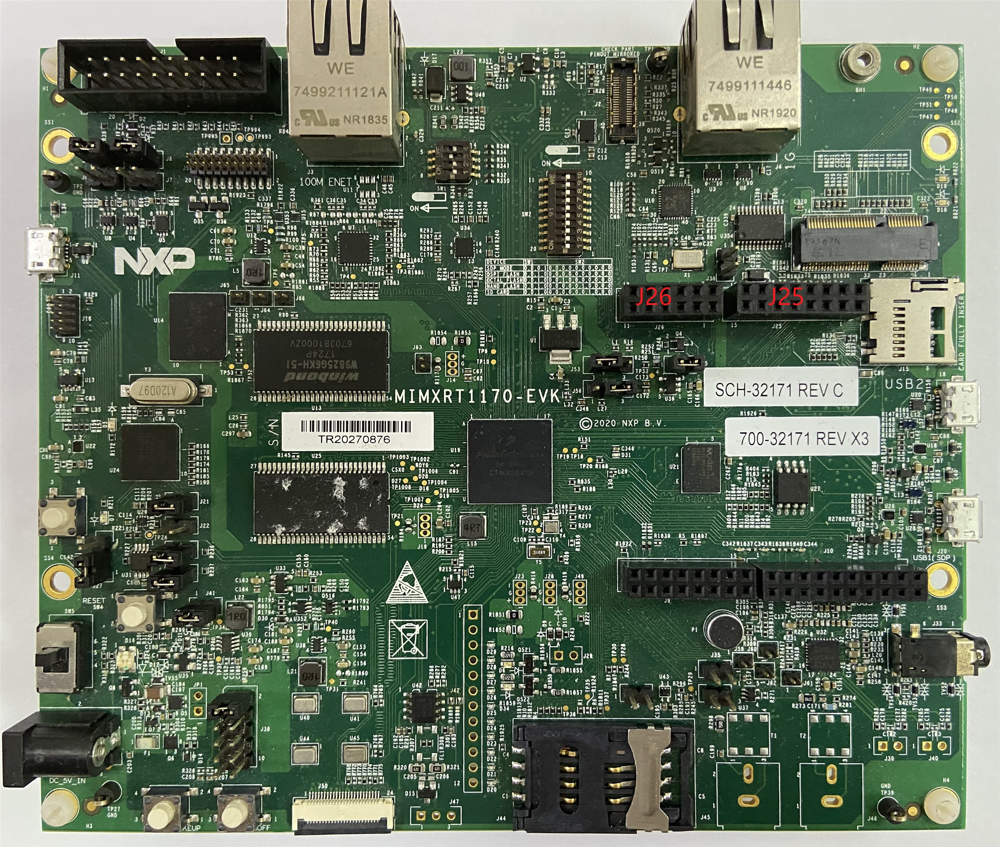
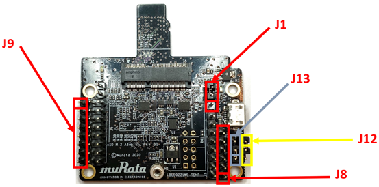

# Hardware rework

**HCI UART rework:**

Connect the TX/RX/RTS/CTS pins of two boards as the following table using jumper cables include in the Murata’s uSD-M.2 Adapter kit.

|Pin name|uSD-M.2 adapter pin|i.MX RT1170 pin|Pin name|GPIO name of RT1170|
|--------|-------------------|---------------|--------|-------------------|
|BT\_UART\_TXD\_HOST|J9 \(pin 1\)|J25 \(pin 13\)|LPUART7\_RXD|GPIO\_AD\_01|
|BT\_UART\_RXD\_HOST|J9 \(pin 2\)|J25 \(pin 15\)|LPUART7\_TXD|GPIO\_AD\_00|
|BT\_UART\_CTS\_HOST|J8 \(pin 4\)|J25 \(pin 9\)|LPUART7\_RTS|GPIO\_AD\_03|
|BT\_UART\_RTS\_HOST|J8 \(pin 3\)|J25 \(pin 11\)|LPUART7\_CTS|GPIO\_AD\_02|

**Murata uSD-M.2 jumper settings:**

-   Both J12 and J13 = 1-2 \(WLAN-SDIO = 1.8 V; and BT-UART and WLAN/BT-CTRL = 3.3 V\)
-   J1 = 2-3 \(3.3 V from uSD connector\)

**Parent topic:**[Hardware Rework Guide for MIMXRT1170-EVK and Murata uSD-M.2 Adapter](../topics/hardware_rework_guide_for_mimxrt1170-evk_and_murat.md)

