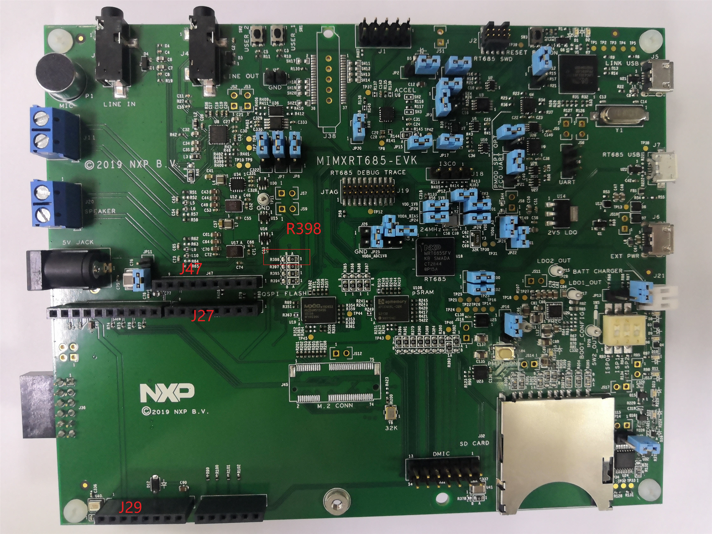
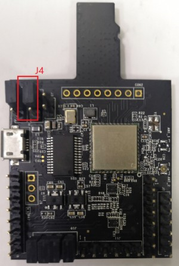

# Hardware rework

**HCI UART rework**

R398 move from 1-2 to 2-3.

Connect the pins of two boards as the following table.

|**Pin Name**|**AW-CM358-USD**|**i.MXRT685**|**PIN NAME**|**GPIONAME of RT685**|
|------------|----------------|-------------|------------|---------------------|
|**UART\_TXD**|J10 \(pin 4\)|J27 \(pin 1\)|USART4\_RXD|FC4\_RXD\_SDA\_MOSI\_DATA|
|**UART\_RXD**|J10 \(pin 2\)|J27 \(pin 2\)|USART4\_TXD|FC4\_TXD\_SCL\_MISO\_WS|
|**UART\_RTS**|J10 \(pin 6\)|J47 \(pin 9\)|USART4\_CTS|FC4\_CTS\_SDA\_SSEL0|
|**UART\_CTS**|J10 \(pin 8\)|J27 \(pin 5\)|USART4\_RTS|FC4\_RTS\_SCL\_SSEL1|
|**GND**|J6 \(pin 7\)|J29 \(pin 6\)|GND|GND|

**Jumper Setting:**

Connect J4\[1-2\] for VIO 1.8 V supply.

**PCM interface rework**

Connect the pins of two boards as the following table.

| Pin Name | AW-CM358-USD | i.MX RT685  | PIN NAME of RT685 | GPIONAME of RT685     |
| -------- | ------------ | ----------- | ----------------- | --------------------- |
| PCM_IN   | J11 (pin 1)  | J47 (pin 7) | I2S2_TXD          | FC2_RXD_SDA_MOSI_DATA |
| PCM_OUT  | J11 (pin 2)  | J28 (pin 4) | I2S5_RXD          | FC5_RXD_SDA_MOSI_DATA |
| PCM_SYNC | J11 (pin 3)  | J28 (pin 5) | I2S5_WS           | FC5_TXD_SCL_MISO_WS   |
| PCM_CLK  | J11 (pin 4)  | J28 (pin 6) | I2S5_SCK          | FC5_SCK               |
| GND      | J11 (pin 5)  | J29 (pin 7) | GND               | GND                   |

**Parent topic:**[Hardware Rework Guide for MIMXRT685-EVK and AW-CM358-uSD](../topics/hardware_rework_guide_for_mimxrt685-evk_and_aw-cm3.md)

