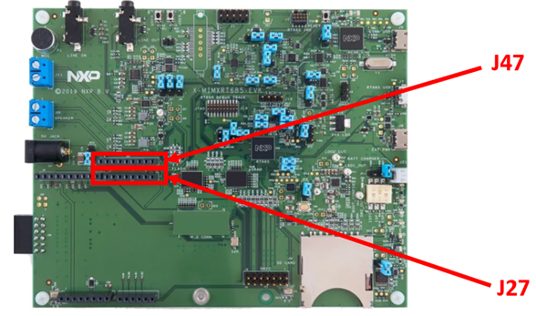
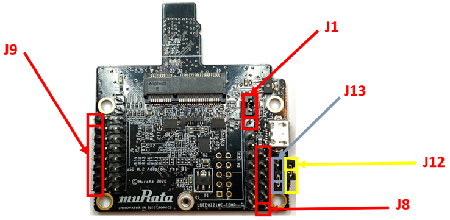

# Hardware rework

**HCI UART rework :**

-   JP12 2-3
-   Connect the pins of two boards as the following table using jumper cables included in Murata’s uSD-M.2 Adapter kit.

|Pin name|uSD-M.2 adapter pin|i.MX RT685 pin|Pin name of RT685|GPIO name of RT685|
|--------|-------------------|--------------|-----------------|------------------|
|BT\_UART\_TXD\_HOST|J9 \(pin 1\)|J27 \(pin 1\)|USART4\_RXD|FC4\_RXD\_SDA\_MOSI\_DATA|
|BT\_UART\_RXD\_HOST|J9 \(pin 2\)|J27 \(pin 2\)|USART4\_TXD|FC4\_TXD\_SCL\_MISO\_WS|
|BT\_UART\_RTS\_HOST|J8 \(pin 3\)|J47 \(pin 9\)|USART4\_CTS|FC4\_CTS\_SDA\_SSEL0|
|BT\_UART\_CTS\_HOST|J8 \(pin 4\)|J27 \(pin 5\)|USART4\_RTS|FC4\_RTS\_SCL\_SSEL1|

**Murata uSD-M.2 jumper settings:**

-   Both J12 and J13 = 1-2 \(WLAN-SDIO = 1.8 V; and BT-UART and WLAN/BT-CTRL = 3.3 V\)
-   J1 = 2-3 \(3.3 V from uSD connector\)

**Parent topic:**[Hardware Rework Guide for MIMXRT685-EVK and Murata uSD-M.2 Adapter](../topics/hardware_rework_guide_for_mimxrt685-evk_and_murata.md)

