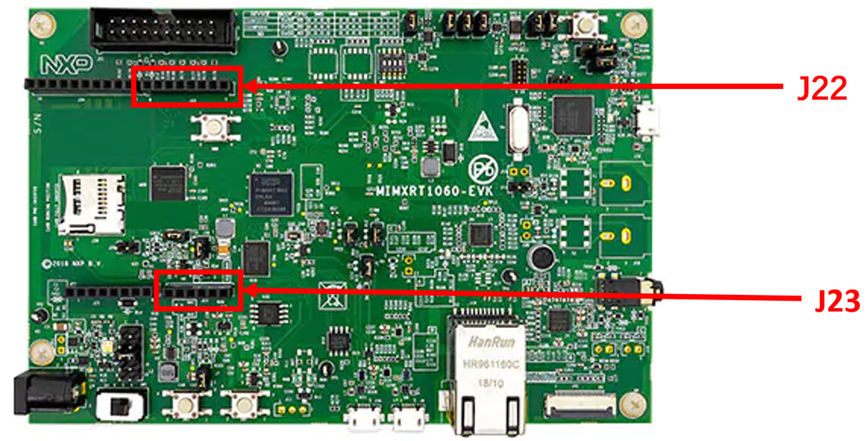
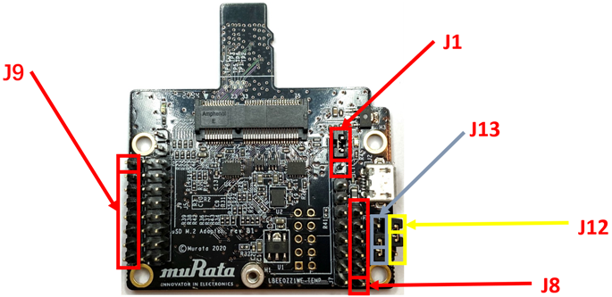

# Hardware rework

-   **HCI UART rework**

Connect the TX/RX/RTS/CTS pins of two boards as the following table using jumper cables include in Murata’s uSD-M.2 Adapter kit.

|Pin name|uSD-M.2 adapter pin|i.MX RT1060 pin|Pin name of RT1060|GPIO name of RT1060|
|--------|-------------------|---------------|------------------|-------------------|
|BT\_UART\_TXD\_HOST|J9 \(pin 1\)|J22 \(pin 1\)|LPUART3\_RXD|GPIO\_AD\_B1\_07|
|BT\_UART\_RXD\_HOST|J9 \(pin 2\)|J22 \(pin 2\)|LPUART3\_TXD|GPIO\_AD\_B1\_06|
|BT\_UART\_RTS\_HOST|J8 \(pin 3\)|J23 \(pin 3\)|LPUART3\_CTS|GPIO\_AD\_B1\_04|
|BT\_UART\_CTS\_HOST|J8 \(pin 4\)|J23 \(pin 4\)|LPUART3\_RTS|GPIO\_AD\_B1\_05|

**Murata uSD-M.2 jumper settings:**

-   Both J12 and J13 = 1-2 \(WLAN-SDIO = 1.8 V; and BT-UART and WLAN/BT-CTRL = 3.3 V\)
-   J1 = 2-3 \(3.3 V from uSD connector\)

## **PCM interface rework** {#pcmsec .section}

Connect the PCM\_IN/PCM\_OUT/PCM\_SYNC/PCM\_CLK/GND pins of the two boards as shown in the following table.

|Pin name|uSD-M.2 adapter pin|i.MXRT1060-EVKB pin|Pin name of RT1060-EVKB|GPIO name of RT1060-EVKB|
|--------|-------------------|-------------------|-----------------------|------------------------|
|PCM\_IN|J5 \(pin1\)|J16 \(pin5\)|SAI2\_TXD|GPIO\_AD\_B0\_09|
|PCM\_OUT|J5 \(pin3\)|TP11|SAI2\_RXD|GPIO\_AD\_B0\_08|
|PCM\_SYNC|J5 \(pin5\)|J2 \(pin9\)|SAI2\_RX\_SYNC|GPIO\_AD\_B0\_07|
|PCM\_CLK|J5 \(pin7\)|J10 \(pin2\)|SAI2\_RX\_BCLK|GPIO\_AD\_B0\_06|
|GND|J5 \(pin15\)|J2 \(pin20\)|GND|GND|

**Parent topic:**[Hardware Rework Guide for MIMXRT1060-EVK and Murata uSD-M.2 Adapter](../topics/hardware_rework_guide_for_mimxrt1060-evk_and_murat.md)

