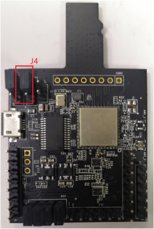
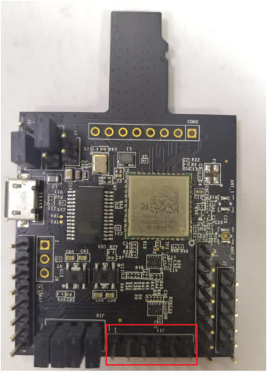

# Hardware rework

-   **HCI UART rework**

    Connect the pins of two boards as the following table.

    Make sure that the resistors R368/R376/R347/R349/R365/R363/R193/R186 are removed.

    |Pin Name

|AW-​CM358-​USD

|i.​MXRT1060

|PIN NAME

|GPIO NAME of RT1060

|
    |----------|----------------|-------------|----------|---------------------|
    |UART\_​TXD|J10 \(pin 4\)

|J16 \(pin 1\)

|LPUART3\_​RXD

|GPIO\_​AD\_​B1\_​07

|
    |UART\_​RXD|J10 \(pin 2\)

|J16 \(pin 2\)

|LPUART3\_​TXD

|GPIO\_​AD\_​B1\_​06

|
    |UART\_​RTS|J10 \(pin 6\)

|J33 \(pin 3\)

|LPUART3\_​CTS

|GPIO\_​AD\_​B1\_​04

|
    |UART\_​CTS|J10 \(pin 8\)

|J33 \(pin 4\)

|LPUART3\_​RTS

|GPIO\_​AD\_​B1\_​05

|
    |GND|J6 \(pin 7\)

|J32 \(pin 7\)

|GND

|GND

|

    ")

    ")

    

    Jumper Setting:

    Connect J4\[1-2\] for VIO 1.8 V supply.

-   **PCM interface rework**

    Connect the pins of two boards as the following table.

    |PIN NAME|AW-​CM358-​USD|I.​MXRT1060|PIN NAME OF RT1060|GPIO NAME of RT1060|
    |--------|--------------|-----------|------------------|-------------------|
    |PCM\_​IN|J11 \(pin 1\)

|J16 \(pin 5\)

|SAI2\_​TXD

|GPIO\_​AD\_​B0\_​09

|
    |PCM\_​OUT|J11 \(pin 2\)

|TP11

|SAI2\_​RXD

|GPIO\_​AD\_​B0\_​08

|
    |PCM\_​SYNC|J11 \(pin 3\)

|J2 \(pin 9\)

|SAI2\_​RX\_​SYNC

|GPIO\_​AD\_​B0\_​07

|
    |PCM\_​CLK|J11 \(pin 4\)

|J10 \(pin 2\)

|SAI2\_​RX\_​BCLK

|GPIO\_​AD\_​B0\_​06

|
    |GND|J11 \(pin 6\)

|J2 \(pin 20\)

|GND

|GND

|

    ")

    ")

    **Note:**

    To support HFP feature, you must remove R381 on MIMXRT1060-EVKB.

    

**Parent topic:**[Hardware Rework Guide for MIMXRT1060-EVKB and AW-CM358-uSD](../topics/hardware_rework_guide_for_mimxrt1060-evkb_and_aw-c_001.md)

