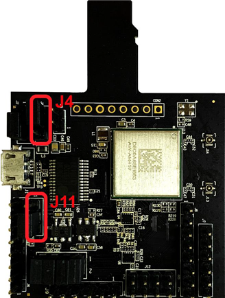
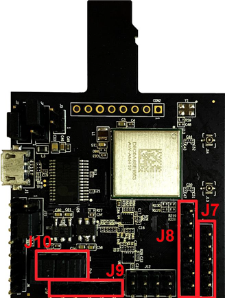

# Hardware rework

-   **HCI UART rework**

    Make sure resistors R368/R376/R347/R349/R365/R363/R193/R186 are removed.

    Connect the pins of two boards as the following table.

    |Pin Name|AW-​AM457-​uSD|i.​MXRT1060|PIN NAME|GPIO NAME of RT1060|
    |--------|--------------|-----------|--------|-------------------|
    |**UART\_​TXD**|J10 \(pin 4\)|J16 \(pin 1\)|LPUART3\_​RXD|GPIO\_​AD\_​B1\_​07|
    |**UART\_​RXD**|J10 \(pin 2\)|J16 \(pin 2\)|LPUART3\_​TXD|GPIO\_​AD\_​B1\_​06|
    |**UART\_​RTS**|J10 \(pin 6\)|J33 \(pin 3\)|LPUART3\_​CTS|GPIO\_​AD\_​B1\_​04|
    |**UART\_​CTS**|J10 \(pin 8\)|J33 \(pin 4\)|LPUART3\_​RTS|GPIO\_​AD\_​B1\_​05|
    |**GND**|J6 \(pin 7\)|J32 \(pin 7\)|GND|GND|

    ")

    ")

    

    **Jumper Setting:**

    -   Connect J4\[2-3\] for VIO 3.3 V supply
    -   Connect J11\[2-3\] for VIO\_SD 3.3 V supply
-   **PCM interface rework**

    Connect the pins of two boards as the following table.

    |**PIN NAME**|**AW-​AM457-​USD**|**I.​MXRT1060**|**PIN NAME OF RT1060**|**GPIO NAME of RT1060**|
    |------------|------------------|---------------|----------------------|-----------------------|
    |**PCM\_​IN**|J9 \(pin 1\)|J16 \(pin 5\)|SAI2\_​TXD|GPIO\_​AD\_​B0\_​09|
    |**PCM\_​OUT**|J9 \(pin 2\)|TP11|SAI2\_​RXD|GPIO\_​AD\_​B0\_​08|
    |**PCM\_​SYNC**|J9 \(pin 3\)|J2 \(pin 9\)|SAI2\_​RX\_​SYNC|GPIO\_​AD\_​B0\_​07|
    |**PCM\_​CLK**|J9 \(pin 4\)|J10 \(pin 2\)|SAI2\_​RX\_​BCLK|GPIO\_​AD\_​B0\_​06|
    |**GND**|J9 \(pin 6\)|J2 \(pin 20\)|GND|GND|

    | ")

|

    |")

|

    **Note:**

    To support HFP feature, you must remove R381 on MIMXRT1060-EVKB.

    |

|

**Parent topic:**[Hardware Rework Guide for MIMXRT1060-EVKB and AW-AM457-uSD](../topics/hardware_rework_guide_for_mimxrt1060-evkb_and_aw-a_002.md)

