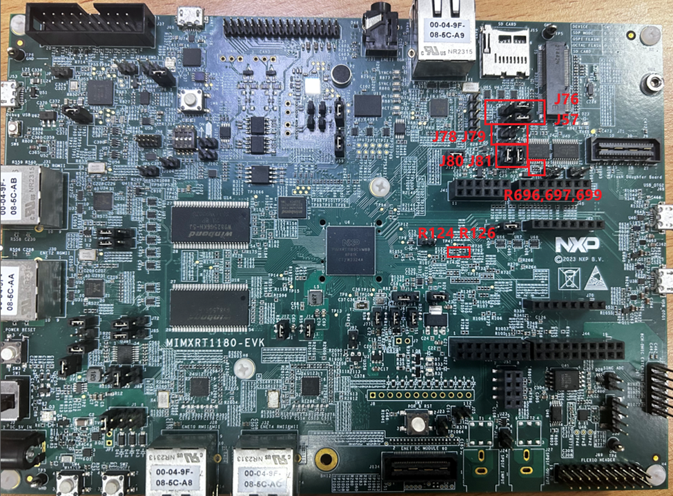

# Hardware rework 

-   HCI UART rework:
    -   Remove: R124,R126
    -   Mount R696, R697
    -   Connect J57 \[2-3\], J76 \[2-3\]
-   PCM interface rework
    -   Mount R699
    -   Disconnect J78 J79
    -   Connect J80 J81

