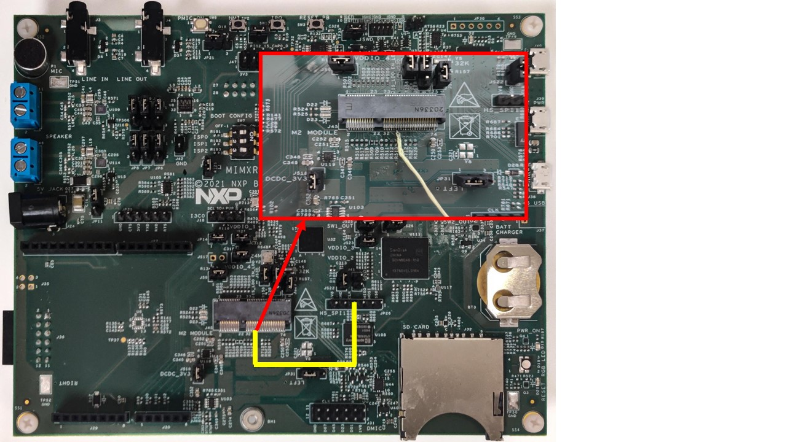
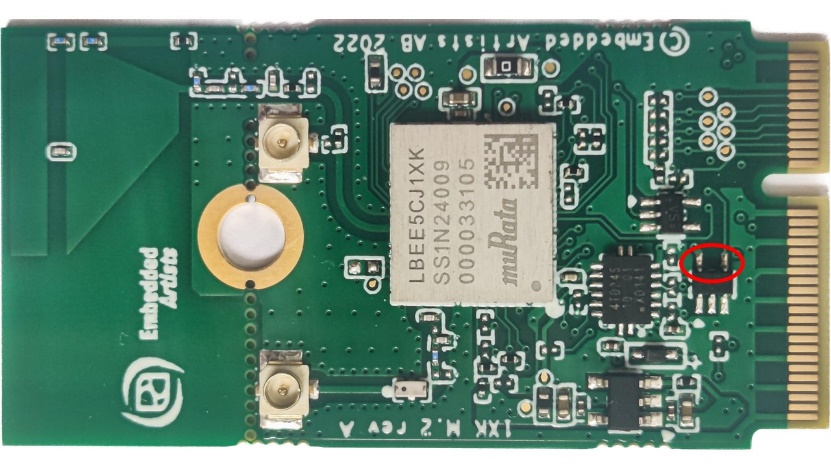

# Hardware rework

**Debug console serial rework:**

For details, refer [Hardware Rework Guide for MIMXRT595-EVK and Murata M.2 Module](hardware_rework_guide_for_mimxrt595-evk_with_direc.md).

**Host wake-up controller pin rework:**

Connect M.2 \(pin 42\) to JP26 \(pin 4\) with a wire.

**Controller wake-up host pin rework:**

1.  Remove resistors R709 on MIMXRT595-EVK.
2.  Solder 10K ohm resistor on the Murata 1XK M.2 Module at the location shown in the following figure.

**Parent topic:**[Hardware Rework Guide for Low Power Feature on MIMXRT595-EVK and Murata 1XK M.2 Module](../topics/hardware_rework_guide_for_mimxrt595-evk_with_murata1XKM2Module.md)

