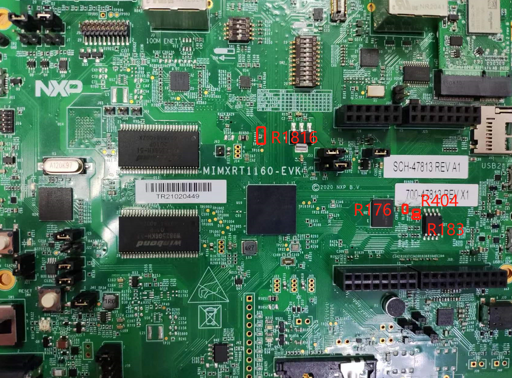
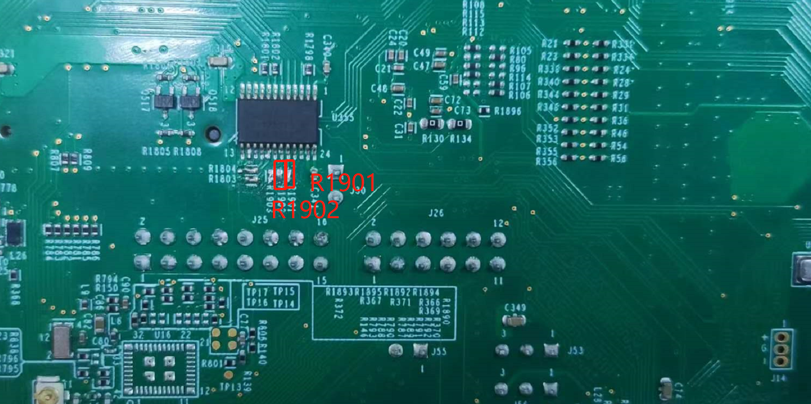
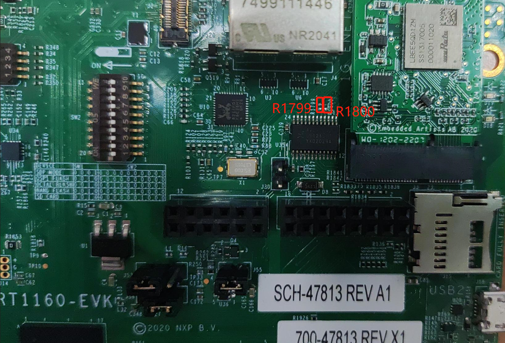
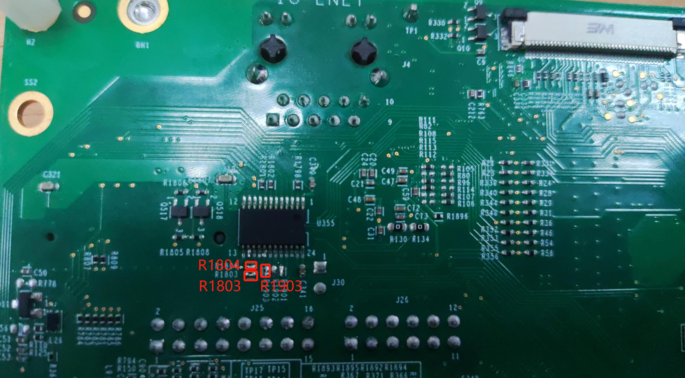

# Hardware Rework Guide for MIMXRT1160-EVK and Murata M.2 Module

This section is a brief hardware rework guidance of the EdgeFast Bluetooth PAL on the NXP i.MX MIMXRT1160-EVK board and the Murata 1XK or 1ZM solution - direct M.2 connection to the Embedded Artists’ EAR00385 \(1XK\) or EAR00364 \(1ZM\) M.2 modules.

## Introduction {#1160evkintro .section}

This section is a brief hardware rework guidance of the EdgeFast Bluetooth PAL on the NXP i.MX MIMXRT1160-EVK and the Murata 1XK M.2 solution.

The hardware rework has two parts:

-   HCI UART rework
-   PCM interface rework

## Hardware rework {#1160evkhwrw .section}

-   HCI UART rework:
    -   Remove: R183 R176 R1816
    -   Add 0 ohm R404 R1901 R1902

        

        

-   PCM interface rework:
    -   Remove R1799 R1800
    -   Add 0 ohm R1903 R1803 R1804

        

        

## Jumper settings for RT1160-EVK enabling 5 V external supply {#1160umper .section}

-   Remove J38 5-6.
-   Connect J38 1-2.
-   Connect J43 with external power; controlled by SW5 .

    **Note:** To run the application after downloading the binary into qspiflash, boot directly from qspiflash and reset the board by pressing SW4 or power off/on the board.

