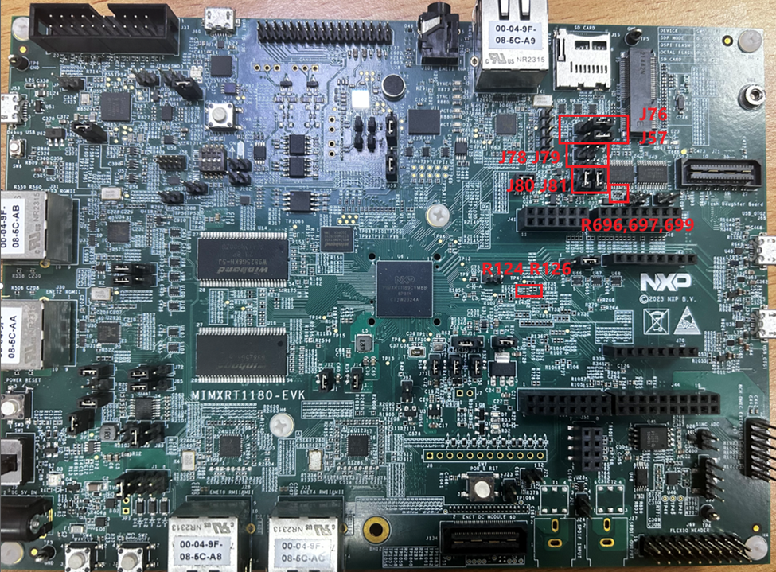

# Hardware Rework Guide for MIMXRT1180 and Murata M.2 Module 

This section is a brief hardware rework guidance of the EdgeFast Bluetooth PAL on the NXP MIMXRT1180 board and the Murata 1XK , 1ZM, or 2EL solution - direct M.2 connection to Embedded Artists’ EAR00385 \(1XK\), EAR00364 \(1ZM\) or Artists’ Rev-A1 \(2EL\) M.2 modules. The hardware rework consists of two parts:

-   HCI UART rework
-   PCM interface rework

## Hardware rework 

-   HCI UART rework:
    -   Remove: R124,R126
    -   Mount R696, R697
    -   Connect J57 \[2-3\], J76 \[2-3\]
-   PCM interface rework
    -   Mount R699
    -   Disconnect J78 J79
    -   Connect J80 J81

