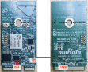

# Hardware rework 
-   **Debug console serial rework**

    For details, refer Section 24 "Hardware Rework Guide for MIMXRT595-EVK and Murata M.2 Module“.

-   **Host wake-up controller pin rework**:

    For details, refer Section 25 "Hardware Rework Guide for Low Power Feature on MIMXRT595-EVK and Murata 1XK M.2 Module ".

-   **Controller wake-up host pin rework:**

1.  Remove resistors R709 on MIMXRT595-EVK,
2.  Solder 0K ohm resistor on R33 of Murata 2EL M.2 Module
3.  Solder 10K ohm resistor on the Murata 2EL M.2 Module between TP1 and TP20.

    

**Parent topic:**[Hardware Rework Guide for Low Power Feature on MIMXRT595-EVK and Murata 2EL M.2 Module](../topics/hardware_rework_guide_for_mimxrt595-evk_with_Murata2ELM.2.md)

