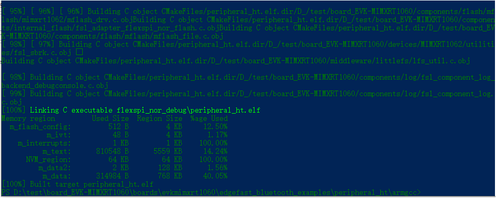

# Build a GCC example

To build a GCC example:

1.  Change the directory to the project directory: `<install_dir>\boards\evkmimxrt1060\edgefast_bluetooth_examples\peripheral_ht\armgcc`.

2.  Run the build script.

    For windows, the script is build\_flexspi\_nor\_debug.bat/ build\_flexspi\_nor\_release.bat.

    The build output is shown in the following figure.

    

**Parent topic:**[Run a demo application using Arm GCC](../topics/run_a_demo_application_using_arm_gcc.md)

