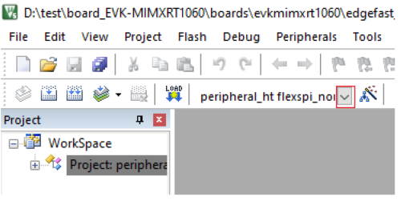
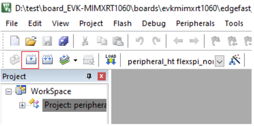

# Build an MDK example

To build an MDK example:

1.  Select *flexspi\_nor\_debug* or f*lexspi\_nor\_release* configurations from the drop-down selector above the project tree in the workspace.

    

2.  Click the highlighted icon to build the EdgeFast Bluetooth Protocol Abstraction Layer project.

    

**Parent topic:**[Run a demo application using MDK](../topics/run_a_demo_application_using_mdk.md)

