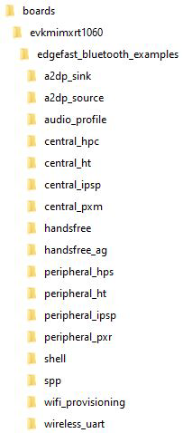

# Folder structure

The following figure shows the EdgeFast Bluetooth examples folder structure.

The following figure shows the EdgeFast Bluetooth Protocol Abstraction Layer host stack folder structure.

The following table provides information regarding the structure and description.

|**Folder**

|**Description**

|
|------------|-----------------|
|*boards/*

 *CMSIS/*

 *devices/*

 *docs/*

 *middleware/*

 *rtos/*

 *tools/*

|MCUXpresso SDK directory. Refer to Chapter 5

 Release contents of MCUXpresso SDK Release Notes at *root/docs/ MCUXpresso SDK Release Notes for EVK-MIMXRT1060.pdf* to *know the details*

|
|*boards/<board\>/wireless/edgefast\_bluetooth\_examples*

|EdgeFast Bluetooth Protocol Abstraction Layer host stack example projects|
|*middleware/wireless/edgefast\_bluetooth*

|EdgeFast Bluetooth Protocol Abstraction Layer host stack source code

|

The EdgeFast Bluetooth folder includes two subfolders:

-   **include**: This subfolder includes EdgeFast Bluetooth Protocol Abstraction Layer host stack headers.
-   **source**: This subfolder includes EdgeFast Bluetooth Protocol Abstraction Layer host stack source code based on the Ethermind Bluetooth host stack APIs.

**Parent topic:**[Overview](../topics/overview.md)

