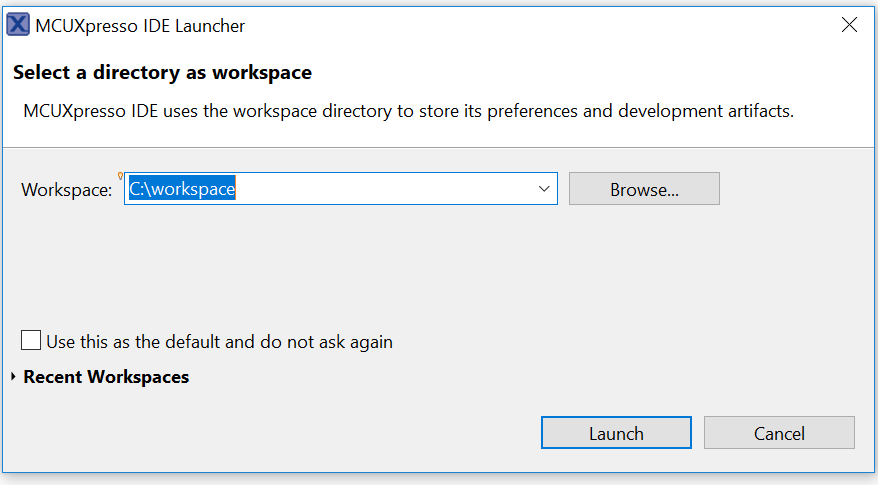
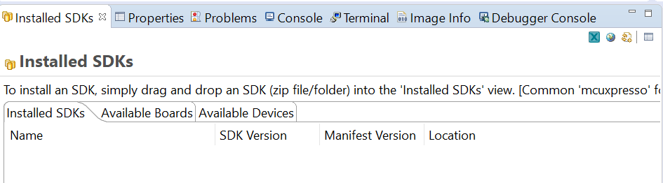
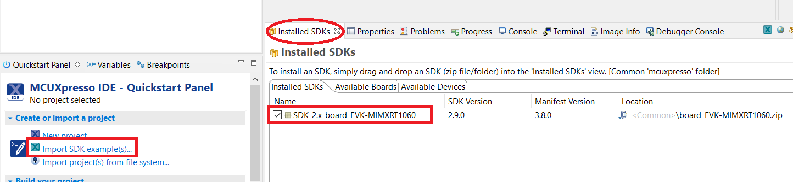
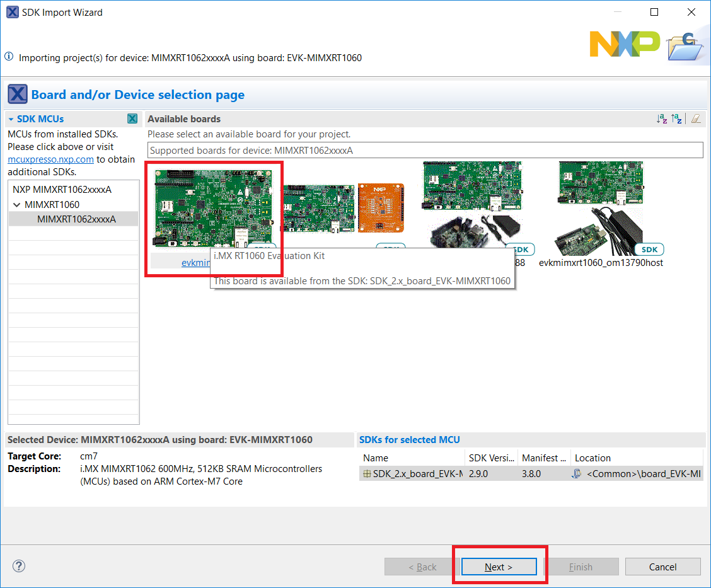
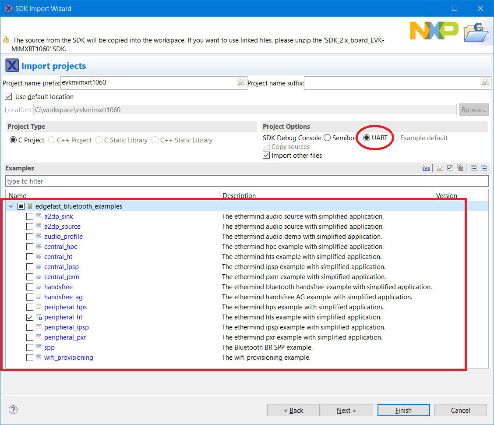

# Open an MCUXpresso IDE example

1.  Open MCUXpresso IDE and open an existing or a new workspace location.

    

2.  Drag and drop the package archive into the MCUXpresso Installed SDKs area in the lower right of the main window.

    

3.  After the SDK is loaded successfully, select the **Import the SDK examples\(s\)…** to add examples to your workspace.

    

4.  Select the evkmimxrt1060 board and click the **Next** button to select the desired example\(s\).

    

5.  Select the evkmimxrt1060 board EdgeFast Bluetooth example. For example, peripheral\_ht.
6.  Ensure to change SDK debug console from **Semihost** to **UART**.
7.  Click **Finish**.

    

**Parent topic:**[Run a demo application using MCUXpresso IDE](../topics/run_a_demo_application_using_mcuxpresso_ide.md)

