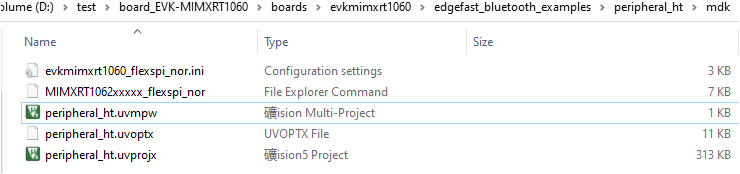

# Open an MDK project

For the IAR Embedded Workbench, unpack the contents of the archive to a folder on a local drive.

1. The example projects are available at: `<root>/boards/evkmimxrt1060/edgefast_bluetooth_examples/peripheral_ht/mdk`.

2. Open the mdk workspace file. For example, the highlighted \*.uvmpw format file.

**Parent topic:**[Run a demo application using MDK](../topics/run_a_demo_application_using_mdk.md)

