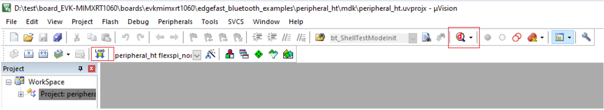

# Run an MDK example

For MDK project running, all steps are similar to [Run an IAR example](run_an_iar_example.md) except the steps of downloading image from compiler.

To download the MDK image to the board, click the **Debug** button. The executable file downloads to the board.

**Parent topic:**[Run a demo application using MDK](../topics/run_a_demo_application_using_mdk.md)

